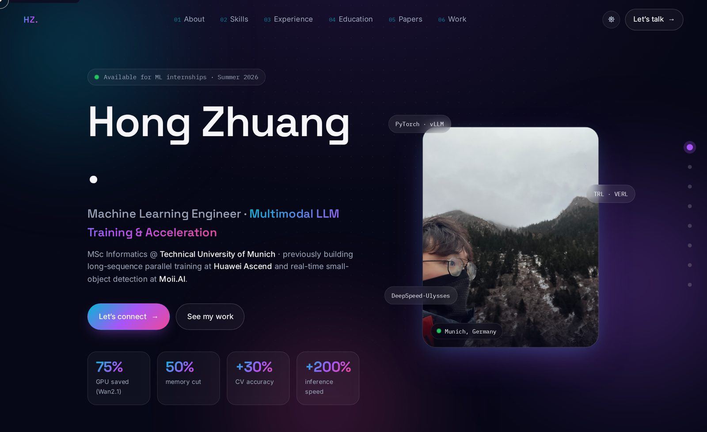
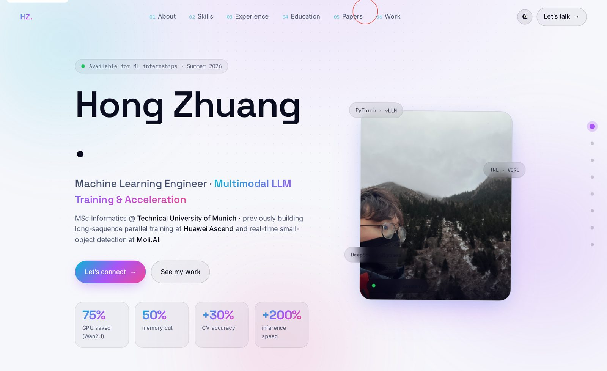

# hzhuang.org

Personal website for **Hong Zhuang** &mdash; Machine Learning Engineer focused on multimodal LLM training, distributed systems, and model acceleration. Live at **[www.hzhuang.org](https://www.hzhuang.org)**.

<p align="center">
  
</p>

<details>
<summary>Light theme preview</summary>
<br>
<p align="center">
  
</p>
</details>

## Highlights

- **Dark / Aurora / Glassmorphism** by default, with a one-click light-mode toggle persisted to `localStorage`.
- **Scroll-driven** &mdash; top nav and a right-edge dot nav both highlight the active section in real time.
- **Hand-built interactions** &mdash; section spy, reveal-on-scroll with stagger, count-up, magnetic buttons, 3D tilt on portrait / bento tiles / project cards, portrait parallax, custom cursor, infinite tech marquee, character-split headline, floating-label form, theme persistence.
- **Accessible** &mdash; respects `prefers-reduced-motion`, AA contrast in both themes, skip-to-content link, every `` carries `alt`, decorative elements are `aria-hidden`.
- **Lean** &mdash; ~70 KB of critical CSS + JS + HTML combined, no framework, no build step.
- **Print-friendly** &mdash; dedicated `@media print` stylesheet produces a clean black-and-white single-column PDF.

## Stack

- 100% vanilla **HTML / CSS / JavaScript** &mdash; nothing to compile.
- Type: **Space Grotesk** (display) + **Inter** (body) + **IBM Plex Mono** (monospaced accents) via Google Fonts.
- Icons: **Font Awesome** (self-hosted under `css/font-awesome/`).
- Form: **[Formspree](https://formspree.io/)** with a honeypot field for spam.
- Host: **GitHub Pages** + custom domain via `CNAME` &rarr; `www.hzhuang.org`.
- CI: a **[lychee](https://github.com/lycheeverse/lychee)**-based link checker runs on every push and pull request.

## Local preview

No build step. Just serve the folder:

```bash
python3 -m http.server 8000
# then open http://localhost:8000
```

## Project layout

```
index.html              single-page site (all sections)
css/
  design.css            full design system: tokens / layout / components / animations / print
  font-awesome/         icon font (self-hosted)
scripts/
  app.js                all interactions: theme spy, reveal, tilt, count-up, cursor, magnetic, marquee
images/                 portraits, project visuals, and README previews
.github/workflows/      lychee link-check workflow
CNAME                   custom domain mapping
```

## Accessibility &amp; motion

- `@media (prefers-reduced-motion: reduce)` disables every non-essential animation (aurora drift, marquee, tilt, custom cursor, character-by-character reveal).
- Cursor effects are additionally gated by `@media (hover: hover) and (pointer: fine)`, so touch devices stay uncluttered.
- All animations use `transform` and `opacity` only &mdash; no layout-thrashing properties.
- Skip-to-content link at the top of the page.

## Page weight

| | Before (MDB + AOS) | After (vanilla) |
|---|---:|---:|
| CSS | ~280 KB | **~33 KB** |
| JS | ~230 KB | **~10 KB** |
| HTML | ~24 KB | ~26 KB |
| **Critical-path total** | **~534 KB** | **~70 KB** |

## Credits

Hand-built. Original starter template (now fully replaced): [TemplateFlip](https://templateflip.com).
